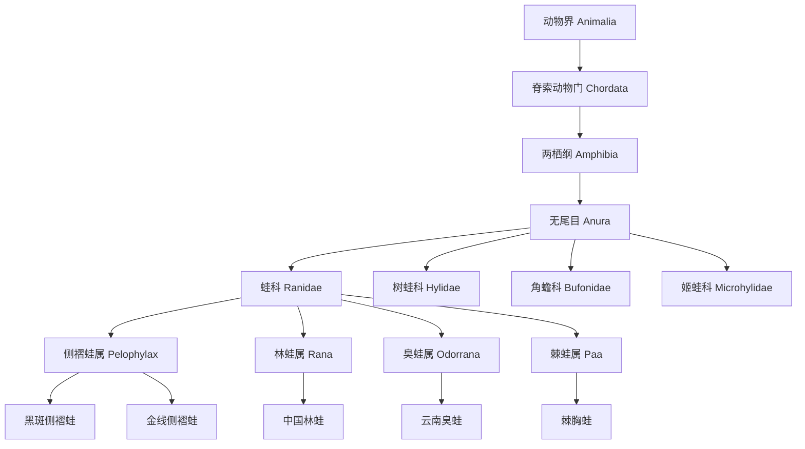

# 长颈鹿头上的毛是啥
长颈鹿头上像天线一样的‘毛’，实际上是特化的皮肤衍生物，由角质构成，类似我们人类的指甲和头发。它们直接覆盖在被称为‘角’的骨质结构上
## 主要功能
这些毛簇虽然看起来像装饰，但具有重要的实用功能：

- 散热：长颈鹿头部血管丰富，毛发有助于调节体温
- 保护：缓冲轻微的碰撞，保护敏感的角心
- 感官辅助：毛发能探测树枝，辅助在树林中穿行
## 关于长颈鹿的‘角’
需特别说明的是，长颈鹿的‘角’与牛、羊等动物的角不同，它们在专业上被称为‘皮骨角’：

- 结构：由软骨内成骨形成的骨质核心，外面覆盖着皮肤和毛发，终身不脱落
- 数量：大多数长颈鹿头顶上有2到3对，5只角
   - 最明显的一对在眼睛上方
   - 脑后中间的一只
   - 眼前方的一对较小的角，并非所有个体都有

为了更清晰的了解，可以看看不同类型毛的功能差异：

|部位|毛的特点|主要功能|
|-|-|-|
|头顶主角|毛簇最长、最显著|标志性特征、保护角心、辅助散热|
|脑后角|毛簇通常较短|保护、缓冲|
|眼睛前方小角|毛较短且稀疏|感官辅助、探测前方环境|
## 其他相关冷知识
- 性别差异：雄鹿的角更粗壮，头顶的毛簇因为打斗和摩擦，往往磨损地更厉害，甚至完全秃掉
- 打架方式：雄鹿会用脖子挥击对手，头部和角是主要武器，此时厚厚的皮肤和毛发能起到一定的保护作用

简单来说，长颈鹿头上的毛是带有功能性的‘毛发天线’，它们和独特的皮骨角一起，构成了长颈鹿最具辨识度的特征

如果你对长颈鹿的其他方面，例如它们的长脖子如何影响血压、独特的斑纹有何作用，或者对它们的社会行为感兴趣，我可以继续为你介绍

-— — — — — — — — — — — — — —

考拉和树袋熊是同一种动物的不同名称，不存在生物学上的区别。以下从多角度详细说明两者的关系及该物种的特征：

🐨 1. ​​名称与分类
- 名称统一性：树袋熊是中文正式名称，而‘考拉’Koala是其英文名称的音译，在澳大利亚及国际通用。两者指代同一物种，学名为Phascolarctos cinereus
- 分类地位：属于哺乳纲双门齿目树袋熊科，是树袋熊科现存的唯一物种，和袋鼠、袋熊等同属有袋类，而非食肉目的熊科

🧬 2. ​​形态和生理特征
- 外形：体长60到85厘米，体重4到15千克，南方种群更重。毛色以灰色为主，胸部淡黄，臀部斑驳；无尾，四肢强健具爪，雄性爪更弯曲便于攀爬；鼻大裸露，耳圆被毛
- 适应性：桉树叶含单宁等毒素，考拉依靠长达2米的肠道及共生菌群解毒，但食物能量低，故每日睡眠长达18到22小时以减少消耗

🌏 3. ​​分布和栖息地
- 地理范围：仅分布于澳大利亚东部（昆士兰、新南威尔士、维多利亚等州），栖息于桉树林地，依赖特定桉树种类为食
- 栖息需求：选择桉树密度高、靠近水源的区域，领地范围因性别和地区差异显著，如昆士兰雄性领地达135公顷

🌿 4. ​​行为与生态​​
- 食性：几乎专食桉树叶，占食物95%以上，偶尔摄入其他植物。每日进食1.3千克叶片，通过嗅闻选择成熟叶片，傍晚到夜间为摄食高峰

- 社会性：独居且领域性强，雄性通过胸腺气味标记树木宣示领地。母兽和幼崽有紧密互动，幼崽需在育儿袋生活6到7个月，4岁左右性成熟

⚠️ 5. ​​保护现状​​
- 濒危等级：2014年起被世界自然保护联盟IUCN列为易危VU，主因是栖息地丧失、城市扩张、山火、及衣原体感染，导致种群衰退。1984到2013年间数量减少38%

❗ 常见误解澄清
- 不是熊类：虽然中文名含‘熊’，但考拉属于有袋目，和食肉目的熊无亲缘关系。差异包括：无尾vs有尾、素食vs肉食、树栖vs陆栖为主
- 和树懒区别：树懒分布于南美，行动更缓慢且前肢长于后肢；考拉虽然懒于活动，但攀爬能力更强，且属于不同大陆的特有物种

💎 总结
树袋熊考拉是澳大利亚特有的珍稀有袋类，因外形憨厚得名‘熊’但非熊科。其生存高度依赖桉树林，易危现状呼吁加强栖息地保护。公众需注意名称的统一性及分类学差异，避免和树懒等混淆

这是一个非常有趣且具体的问题！它涉及到两个完全不同物种的奇特互动

简单直接的回答是：螃蟹无法真正‘消化’犀鸟的羽毛。它们**会通过物理方式磨碎羽毛，但绝大部分，尤其是角蛋白部分，会以纤维的形式随粪便排出体外**

下面详细解释一下这个过程以及为何螃蟹会吃羽毛：

螃蟹为何会吃羽毛？

虽然听起来奇怪，但**螃蟹是典型的机会主义杂食动物**。它们的食谱非常广，包括腐肉、小型贝类、蠕虫、藻类、有机碎屑等。一根从树上掉落的犀鸟羽毛，对螃蟹来说可能被误认为是：

1. 可能的食物来源：羽毛由角蛋白构成，和人类指甲头发成分相同，含有蛋白质和氨基酸，虽然难以消化，但螃蟹的简单消化系统会‘尝试’以下

2. 附着的美食：羽毛在掉落过程中可能会沾上微小的有机物、真菌或细菌群落。螃蟹可能是为了吃这些更容易消化的附着物而顺便吞下了羽毛

3. 好奇或误食：螃蟹用钳子探索环境，可能会把羽毛当作环境中的碎屑处理，并习惯性地送入嘴中

螃蟹针对羽毛的消化过程

螃蟹的消化系统是为了处理坚硬、粗糙的食物，如贝壳、甲壳，而设计的，对付一根羽毛的过程大致如下：

1. 物理磨碎——核心步骤
   - 胃磨（Gastric Mill）：这是最关键的一步，螃蟹的胃里面有个特殊结构‘胃磨’，俗称‘胃石’。它由几块坚硬的钙质齿和肌肉组成，就像一个生物搅拌机或牙齿
   - 羽毛被吞食后进入胃中，胃磨会通过肌肉的收缩和舒张，剧烈地摩擦、研磨、撕扯这根羽毛，将其物理性破碎成非常短小的纤维碎片

2. 非常有限的化学分解
   - 螃蟹会分泌消化酶，但是这些酶主要针对的是蛋白质、脂肪、和碳水化合物，对于角蛋白（Keratin）这种极其稳定和坚硬的蛋白质，螃蟹以及绝大多数动物缺乏专门分解它的角蛋白酶（Keratinase）
   - 因此，化学消化对羽毛的作用微乎其微。只能分解羽毛上可能附着的少量其他有机物或者羽毛本身极少量的非角蛋白成分

3. 吸收与排出
   - 经过胃磨的物理粉碎后，形成的浆状物会进入肠道
   - 肠道只能吸收那些被粉碎后释放出来的、可以被现有酶处理的微量营养物质
   - 最终，超过95%的羽毛角蛋白纤维无法被消化和吸收。这些纤维会与其他未消化的物质混合，被排出体外，形成粪便

总结和类比

您可以这样理解这个过程：
   螃蟹消化羽毛，就像人吃了一团自己的毛发。人的胃也无法消化角蛋白，头发最终会基本上原样排出，有时可能会缠结成团引起不适。螃蟹的‘胃磨’更强大，它能将羽毛磨得更碎，但本质不变

所以，一根犀鸟的羽毛在螃蟹体内的旅程是：
被钳子抓住=》送入胃中=》被‘胃磨’物理粉碎=》极微量成分被吸收=》绝大部分作为纤维残渣随粪便排出

这个过程展示了螃蟹作为一种清道夫，如何高效地处理环境中各种类型的‘废物’，即使它们并不能从中获得太多营养

人们喜爱小龙虾的现象，是多重社会、文化和生理因素共同作用的结果。综合搜索结果分析，其核心原因可分为以下五个维度：

---

### 🍤 **一、独特的风味与沉浸式进食体验**
1. **肉质与口感**
   - 小龙虾尾部肌肉紧实，烹饪后呈现**Q弹鲜嫩**的口感，易形成味觉依赖[citation:2]。
   - 外壳能充分吸附**麻辣、蒜蓉、十三香**等重口味调料，契合中国消费者对浓郁风味的偏好[citation:2]。
2. **剥壳的仪式感**
   - 剥壳过程延长进食时间，增强对食物的期待感，类似“游戏化奖励机制”（剥壳→吃肉→满足感循环）[citation:2][citation:3]。

---

### 👥 **二、社交属性的强化：从食物到社交媒介**
1. **聚餐催化剂**
   - 双手剥虾的操作**天然减少手机使用**，强制面对面交流，成为朋友聚会、夜宵摊的“破冰食物”[citation:1][citation:2]。
   - 按斤/大盘装的分食模式，营造**热闹共享氛围**，类似火锅的集体参与感[citation:2]。
2. **场景绑定**
   - 与**夏季夜宵文化**深度绑定：露天排档、冰啤酒、烟火气，象征放松与季节性狂欢[citation:2][citation:3]。

---

### ⏳ **三、季节性稀缺与消费心理驱动**
1. **限时供应效应**
   - 传统上市期集中在**5-9月**，“错过再等一年”的稀缺感刺激消费冲动[citation:2]。
2. **网红经济助推**
   - 社交媒体上的**打卡晒图、网红探店**推高流行度，吸引年轻群体跟风尝试[citation:2]。
   - 美团数据显示，小龙虾占互联网餐饮市场TOP10菜品销量的4%，成为“流量担当”[citation:1]。

---

### 🏭 **四、产业链成熟与商业推动**
1. **养殖与供应保障**
   - 中国已成**全球最大小龙虾生产国**（湖北、江苏规模化养殖），价格平民化（如旺季初期高价，随产量增加回落）[citation:2][citation:3]。
2. **餐饮标准化与创新**
   - 从街边摊到连锁品牌（如“文和友”“胡大”），开发多元口味降低尝试门槛[citation:2]。
   - 必胜客、肯德基等推出小龙虾披萨等跨界产品，拓宽消费场景[citation:1]。
3. **物流与外卖助力**
   - 冷链配送完善，疫情期间外卖需求进一步推动家庭消费[citation:1][citation:2]。

---

### 🥗 **五、健康价值与科学认知更新**
1. **营养优势**
   - **高蛋白低脂**：每100克虾肉含蛋白质16克（≈2个鸡蛋），脂肪仅1%，热量90大卡，适合健身人群[citation:3][citation:4][citation:5]。
   - **矿物质与抗氧化剂**：富含钙、锌、镁及虾青素（抗炎、护心血管）[citation:3][citation:5]。
2. **风险可控化**
   - **寄生虫/重金属**：正规养殖虾安全性高，100℃烹饪5分钟可灭活寄生虫；虾线、鳃部去除可减少污染摄入[citation:3]。
   - **痛风友好**：嘌呤含量中等（60mg/100g），急性发作期避免，缓解期可少量食用（建议<10只）且避免配啤酒[citation:3]。

---

### 💎 **结语：食物背后的时代情绪**
小龙虾的走红是“天时（季节性）、地利（产业链）、人和（社交需求）”的完美结合——它既是**现代人释放压力的味觉出口**，也是**数字化时代稀缺的实体社交载体**。
> 剥一只虾，是唇齿间的麻辣盛宴，也是放下手机后的一场微型重逢。从夜市摊的烟火到朋友圈的九宫格，它最终成为我们对热闹、松弛与联结的集体渴望[citation:1][citation:2]。

小龙虾作为高蛋白食材，其氨基酸组成具有全面均衡的特点，不仅包含人体必需的8种氨基酸，还富含多种特殊氨基酸，营养价值显著优于一般肉类。以下是具体分析：

---

### 🧬 **一、必需氨基酸：种类全面，比例均衡**
小龙虾含有**全部8种人体必需氨基酸**（即人体无法自身合成、必须从食物中获取的氨基酸），包括[citation:1][citation:2][citation:3]：
- **异亮氨酸**：促进肌肉修复，调节血糖。
- **色氨酸**：合成血清素，改善睡眠和情绪。
- **赖氨酸**：增强免疫力，促进钙吸收。
- **苯丙氨酸**：参与神经递质合成。
- **缬氨酸**：维持神经系统功能。
- **苏氨酸**：支持胶原蛋白合成，保护肝脏。
- **甲硫氨酸（蛋氨酸）**：抗氧化，保护细胞。
- **亮氨酸**：促进肌肉合成与修复。

**特点**：小龙虾的必需氨基酸组成优于普通肉类，生物利用率高，更易被人体吸收利用[citation:1][citation:7]。

---

### 🔬 **二、特殊氨基酸：稀有成分强化健康价值**
除必需氨基酸外，小龙虾还含有两类高价值特殊氨基酸：
1. **精氨酸**
   - **含量**：显著高于一般脊椎动物肉类[citation:1][citation:2]。
   - **功能**：促进伤口愈合、增强免疫力、调节血管功能（如一氧化氮合成）[citation:1][citation:8]。
2. **组氨酸**
   - **重要性**：婴幼儿生长发育必需，成人需从食物补充[citation:1][citation:3]。
   - **功能**：抗炎、抗氧化，保护神经系统健康[citation:2]。

---

### 🍽️ **三、风味氨基酸：鲜甜口感的来源**
小龙虾的鲜美口感与其游离氨基酸组成密切相关，尤其以下三类风味氨基酸含量突出[citation:5]：
| **氨基酸类型** | **代表物质**      | **风味贡献**       | **主要分布部位**       |
|----------------|-------------------|--------------------|------------------------|
| **鲜味氨基酸** | 谷氨酸、天冬氨酸  | 类似味精的鲜味     | 头部（虾黄）＞虾肉     |
| **甜味氨基酸** | 甘氨酸、丙氨酸    | 清甜回甘           | 虾肉为主               |
| **芳香氨基酸** | 酪氨酸、苯丙氨酸  | 增强风味层次感     | 整体均匀分布           |

**科学依据**：
- 虾头中鲜味氨基酸占游离氨基酸总量的39.88%，是烹调后浓郁风味的关键[citation:5]。
- 虾肉中苏氨酸、精氨酸、甘氨酸含量最高，共同赋予清甜口感[citation:5]。

---

### ⚖️ **四、营养价值与健康作用**
小龙虾的氨基酸组合赋予其多重生理功能：
1. **增强免疫力**：优质蛋白促进抗体合成，精氨酸激活免疫细胞[citation:1][citation:8]。
2. **促进发育与修复**：苏氨酸、亮氨酸支持儿童生长发育及组织修复[citation:1][citation:6]。
3. **调节代谢功能**：缬氨酸、异亮氨酸维持神经系统和肌肉协调性[citation:1][citation:3]。
4. **抗氧化抗炎**：组氨酸、甲硫氨酸减少氧化损伤，缓解慢性炎症[citation:2][citation:8]。

---

### 💎 **总结**
小龙虾的氨基酸谱系兼具**全面性、稀有性与风味性**：
- **必需氨基酸全覆盖**：满足人体基础需求，生物利用率高；
- **精氨酸与组氨酸**：强化免疫、神经保护与发育支持；
- **风味氨基酸集群**：谷氨酸、甘氨酸等赋予独特鲜甜，使小龙虾成为兼具营养与美味的优质食材[citation:1][citation:5][citation:7]。

> 提示：小龙虾头部虽风味浓郁，但易富集重金属，建议优先食用虾肉并去除虾线，以平衡安全与营养[citation:4][citation:6]。

蝉的声音是自然界中最具标志性的夏季音景之一，其形成机制、声学特性及生态意义均蕴含复杂的生物学原理。以下从科学机制、声学特性、生态功能、文化内涵及人类感知五个维度综合分析：

---

### 🔊 **一、发声机制：精密的生物声学系统**
1. **核心器官与工作原理**
   - **鼓膜振动器**：雄蝉腹部基部有一对鼓膜（发音器），由弹性薄膜和鸣肌构成。鸣肌每秒收缩频率达**1万次**，拉动鼓膜产生高频振动[citation:1][citation:3][citation:8]。
   - **共鸣放大**：鼓膜与盖板间的空腔形成“共鸣箱”，将振动放大至**70–130分贝**（相当于割草机噪音），传播距离可达数百米[citation:4][citation:8][citation:10]。
   - **雌蝉无声**：雌蝉缺乏鼓膜结构，无法发声，故称“哑巴蝉”[citation:1][citation:3]。

2. **能量消耗与温度依赖**
   - 鸣叫是极高能耗行为，需持续吸食树液补充能量[citation:3]。
   - 高温（>25℃）可提升鸣肌活性，使声音更响亮；低温或阴雨天气则显著抑制鸣叫[citation:4][citation:5]。

---

### 📊 **二、声学特性：高频、强穿透力与物种多样性**
1. **频率与波形**
   - **主频范围**：**4–8 kHz**（人类可听范围上限），部分种类可达15 kHz，属高频窄带脉冲声[citation:4][citation:6][citation:8]。
   - **非次声波**：频率远高于次声波（<20 Hz），故无次声波特性[citation:8]。

2. **类型与物种差异**
   | **蝉类**       | **典型鸣声**      | **声学特点**               |
   |----------------|-------------------|---------------------------|
   | 知了蝉（蚱蝉）  | “知了——知了——”    | 持续性强，节奏稳定          |
   | 黑蚱蝉          | “嘻！嘻！嘻！”     | 短促尖锐，夜间活跃          |
   | 草蝉            | “沙沙沙”          | 低频绵长，草丛栖息          |
   | 鼓蝉            | “咚、咚、咚”      | 浑厚有节奏，大型种特有      |
   *数据综合自[citation:5][citation:7][citation:10]*

---

### 🔄 **三、生态功能：生存策略的核心**
1. **求偶与繁殖**
   - 雄蝉通过鸣叫吸引雌蝉，不同鸣声代表三种信号：**集合声**（群体协调）、**求偶声**（个体吸引）、**惊扰声**（遇险警告）[citation:3][citation:4][citation:9]。
   - 雌蝉虽无声，但能精准识别同种雄蝉的鸣声频率，避免跨种交配[citation:5]。

2. **防御与领地宣示**
   - 集群鸣叫可**迷惑天敌**（如鸟类），降低个体被捕食风险[citation:9]。
   - 高音量鸣叫能**驱赶竞争者**，标记树木汁液资源丰富的领地[citation:4][citation:10]。

---

### 🎨 **四、文化象征：从自然声景到人文意象**
1. **东方文化中的高洁隐喻**
   - 中国古诗词常以蝉鸣喻“清高”（如虞世南“居高声自远”）或“悲凉”（如王维“临风听暮蝉”）[citation:1][citation:5]。
   - 玉蝉含葬（周汉时期）象征“**蜕浊重生**”，体现永生信仰[citation:1][citation:3]。

2. **西方与现代关联**
   - 竖琴以蝉为装饰标志，隐喻“**自然演奏家**”[citation:1][citation:3]。
   - 日本影视作品用蝉鸣渲染夏日氛围，成为季节符号[citation:5][citation:10]。

---

### 😣 **五、人类感知：噪音与生态平衡的冲突**
1. **负面体验的成因**
   - 高频持续声易引发烦躁感，神经学研究显示其与**粉笔刮黑板声**相似，可能触发大脑杏仁核的应激反应[citation:6][citation:9]。
   - 城市环境中，蝉鸣与交通噪音叠加，声压级可突破**100分贝**，干扰睡眠与专注力[citation:6]。

2. **生态价值不可替代**
   - 蝉鸣为鸟类、蝙蝠提供**觅食信号**，维持食物链稳定[citation:5][citation:10]。
   - 城市化导致的蝉数量减少，可能破坏声景多样性，需通过保护植被、减少农药以平衡生态[citation:5][citation:7]。

---

### 💎 **结语：生命绝响的哲学启示**
蝉以短暂的地上生命（60–70天）爆发式鸣唱，实则是**数年至十七年地下蛰伏的能量释放**[citation:1][citation:3]。其声音既是繁衍的密码，亦是生态网络的纽带，更是人类对自然节律的感知坐标——当我们聆听蝉鸣时，听见的不仅是声波振动，更是**生命在时间维度上的极致浓缩**。

> 法布尔曾感叹蝉“在黑暗中等待十七年，只为阳光下四星期的歌唱” [citation:2]——这声音提醒我们：最短暂的存在，亦可发出最洪亮的生命宣言。

青蛙是否与路人对视，取决于多种生物学因素和行为情境。以下是基于其视觉特性和环境适应的综合分析：

### 🐸 **1. 视觉系统的特性：对运动敏感，对静止物体迟钝**
   - **运动目标优先**：青蛙的视网膜神经细胞分为五类，其中四类专门处理运动目标的特征（如边缘、凸起、明暗变化），只有一类处理颜色[citation:4][citation:6]。这种结构使青蛙能瞬间锁定飞虫等动态猎物，但对静止物体（如站立不动的人）几乎“视而不见”[citation:4][citation:7]。
   - **视野范围有限**：青蛙的眼睛位于头部两侧，提供宽广的视野以监测天敌，但双眼间距较大，难以对静止物体形成立体焦距[citation:7]。因此，除非人类主动移动，否则青蛙很少会“注视”路人[citation:7]。

### 🌿 **2. 行为反应：逃避本能＞社交互动**
   - **威胁感知触发逃跑**：若路人突然靠近或快速移动，青蛙会将其视为威胁，立即跳跃逃离（跳跃距离可达体长的20倍）[citation:2][citation:7]。此时的对视是短暂且被动的应激反应，而非主动“交流”。
   - **静止状态下的无视**：当人类保持静止时，青蛙通常不会持续对视。它们更关注环境中的动态线索（如昆虫飞过），而静止的人类会被忽略[citation:4][citation:8]。

### 🌍 **3. 环境与习性的影响**
   - **栖息地差异**：
     - **自然水域（池塘、稻田）**：青蛙常潜伏在草丛或浅水区，路人路过时可能因脚步声或影子惊动它们，引发短暂对视后逃离[citation:1][citation:8]。
     - **城市环境**：在人工水体（如公园池塘）中，部分青蛙可能对人类活动产生习惯性适应，但仍极少主动对视[citation:6]。
   - **昼夜节律**：作为夜行性动物，青蛙白天多隐藏休息，路人白天偶遇时更可能看到其闭眼或躲藏状态；夜晚活跃期若遇光照（如手电筒），青蛙可能因强光刺激而短暂“愣住”，形成偶然对视[citation:5][citation:8]。

### ⚠️ **4. 例外情况：特殊情境下的对视**
   - **求偶期干扰**：繁殖季的雄蛙专注于鸣叫吸引雌蛙，若路人靠近其领地，可能短暂抬头“瞥视”但迅速恢复鸣叫[citation:5][citation:6]。
   - **人工驯养个体**：长期被人类投喂的青蛙（如养殖场）可能学会关联人类与食物，出现等待喂食时的“注视”，但这属于条件反射而非社交对视[citation:7]。

### 💎 **总结：青蛙与路人对视的可能性**
| **情境**               | **对视可能性** | **原因说明**                                                                 |
|------------------------|----------------|----------------------------------------------------------------------------|
| 路人静止不动           | 极低 🌫️         | 视觉系统忽略静止物体，无法形成有效焦距[citation:4][citation:7]。             |
| 路人快速移动或靠近     | 中（短暂） ⚡    | 触发逃避本能，可能瞬间对视后跳跃逃离[citation:2][citation:8]。               |
| 夜间强光照射（如手电筒） | 中（短暂） 💡    | 强光致短暂僵直，形成被动对视[citation:5]。                                  |
| 繁殖期领地干扰         | 低~中 🎶        | 可能抬头观察威胁，但迅速恢复鸣叫[citation:6]。                              |
| 人工驯养环境           | 较高（条件性） 🥄 | 关联人类与食物，可能主动注视[citation:7]。                                  |

**简单来说**：野外青蛙若与你“对视”，大概率是把你当成了威胁或干扰，下一秒就可能溜走；若它无动于衷，则说明根本没注意到你[citation:1][citation:4]。这种互动远不如哺乳动物（如狗）的情感交流丰富，更多是生存本能的机械反应。

青蛙的分类学体系基于其形态、生态及演化特征，层级分明，以下是其系统分类及关键特征解析：

---

### 🐸 **一、基础分类层级**
1. **界（Kingdom）**：**动物界（Animalia）**
   - 多细胞真核生物，异养生活，具运动能力[citation:2][citation:6]。

2. **门（Phylum）**：**脊索动物门（Chordata）**
   - 胚胎期具脊索、背神经管和鳃裂，成体保留部分特征（如脊椎）[citation:2][citation:7]。

3. **纲（Class）**：**两栖纲（Amphibia）**
   - 生活史包含水陆两阶段：幼体（蝌蚪）水生用鳃呼吸，成体陆生用肺兼皮肤呼吸[citation:2][citation:4][citation:6]。
   - 皮肤裸露无鳞，富含黏液腺，依赖潮湿环境防脱水[citation:4][citation:6]。

4. **目（Order）**：**无尾目（Anura）**
   - 成体无尾，后肢强健善跳跃，前肢较短；卵产于水中，体外受精，经历蝌蚪变态发育[citation:1][citation:2][citation:4]。
   - 全球约6000种，是两栖纲中物种最丰富的类群[citation:3][citation:5]。

5. **科（Family）**：**蛙科（Ranidae）**
   - 严格意义的“青蛙”即指此科，俗称“真蛙科”或“赤蛙科”[citation:1][citation:7]。
   - **典型特征**：
     - 皮肤光滑湿润，背侧常有纵向肤褶（如背侧褶）[citation:1][citation:6]。
     - 舌后端分叉可翻出捕虫，鼓膜明显，趾间具蹼[citation:1][citation:4]。
     - 蝌蚪口部下唇具乳突，无角质喙[citation:1]。
   - **全球分布**：399种（截至2025年），除南极、澳洲及南美南部外广泛分布，中国记录164种[citation:1]。

---

### 🌿 **二、蛙科下级分类及代表属种**
蛙科包含26属，中国常见属及代表种如下：
| **属名**         | **代表物种**           | **特征与分布**                                                                 |
|------------------|------------------------|-------------------------------------------------------------------------------|
| **侧褶蛙属**     | 黑斑侧褶蛙（菜蛙）    | 背侧有双褶，遍布中国东部稻田，昼夜捕虫[citation:1][citation:4]。              |
| *Pelophylax*     | 金线侧褶蛙            | 背绿色带金线，华北池塘常见，蹲伏莲叶伺机捕食[citation:1]。                    |
| **林蛙属**       | 中国林蛙（哈士蟆）    | 高海拔森林栖息，具冬眠习性，输卵管干制为名贵中药“雪蛤”[citation:1][citation:7]。 |
| *Rana*           |                        |                                                                               |
| **臭蛙属**       | 无指盘臭蛙            | 原始物种，分布于横断山区，皮肤分泌物具特殊气味[citation:1]。                  |
| *Odorrana*       | 云南臭蛙              |                                                                               |
| **棘蛙属**       | 棘胸蛙（石鸡）        | 皮肤粗糙多疣，栖溪流石洞，肉质鲜美，中国南方山区分布[citation:1][citation:5]。  |
| *Paa*            |                        |                                                                               |
| **水蛙属**       | 沼蛙                  | 低海拔湿地活动，鸣声低沉，华东华南常见[citation:1]。                          |
| *Hylarana*       | 阔褶蛙                |                                                                               |

---

### 🌍 **三、无尾目其他重要科别**
蛙科仅为无尾目的一部分，其他科别特征对比鲜明：
| **科名**         | **典型代表**      | **关键特征**                                                                 | **生态角色**                              |
|------------------|-------------------|-----------------------------------------------------------------------------|------------------------------------------|
| **树蛙科**       | 树蛙、雨蛙        | 指端具吸盘，树栖攀爬；鸣声悦耳，卵产叶间水洼[citation:3][citation:7]。       | 控制树冠害虫，维持森林生态平衡。          |
| *Hylidae*        |                   |                                                                             |                                          |
| **角蟾科（蟾科）** | 蟾蜍              | 皮肤粗糙多疣，具毒腺（如耳后腺）；陆生为主，耐旱性强[citation:3][citation:7]。 | 毒液御敌，农田害虫天敌。                  |
| *Bufonidae*      |                   |                                                                             |                                          |
| **姬蛙科**       | 狭口蛙            | 体型微小（<5cm），蝌蚪无角质齿，特化腹部吸盘附着[citation:5]。              | 湿地微生物链调控者。                      |
| *Microhylidae*   |                   |                                                                             |                                          |
| **叉舌蛙科**     | 虎纹蛙            | 舌前端分叉，大型蛙（体长>12cm），东南亚稻田优势种[citation:1][citation:5]。   | 捕食螺类、昆虫，减少农业损失。            |

---

### ⚠️ **四、保护现状与受胁因素**
- **濒危等级**：蛙科398种列入IUCN红色名录，1种灭绝（EX），10种极危（CR），37种濒危（EN）[citation:1]。
- **主要威胁**：
  - **栖息地丧失**：湿地开发、森林砍伐导致繁殖水域消失（如中国林蛙依赖的山溪）[citation:1][citation:5]。
  - **污染与病害**：农药残留、水污染致蝌蚪死亡；壶菌病（*Batrachochytrium*）引发全球种群崩溃[citation:4][citation:6]。
  - **过度利用**：食用（如棘胸蛙）、药用（林蛙输卵管）及宠物贸易加剧野生种群压力[citation:1][citation:5]。
- **保护措施**：
  - 建立自然保护区（如横断山区臭蛙栖息地）[citation:1]。
  - 人工繁育放流（如黑斑蛙稻田增殖计划）[citation:6]。

---

### 💎 **五、分类树状图总结**

**演化学意义**：蛙科背侧褶的两种结构（脂肪型/腺体型）体现了能量储存与防御的适应性进化[citation:1]，而臭蛙属在横断山区的分化印证了地理隔离对物种形成的作用[citation:1]。

徒手捕捉癞蛤蟆（蟾蜍）存在健康风险和法律风险，需谨慎对待。以下是关键要点分析：

---

### ⚠️ **一、健康风险：毒液接触可能引发中毒或过敏**
1. **毒液来源与毒性**
   - 癞蛤蟆的耳后腺及皮肤腺会分泌**蟾酥**（白色或黄色黏液），含蟾蜍毒素、肾上腺素类似物等成分，对心脏、神经系统和消化系统有强毒性[citation:1][citation:6][citation:7]。
   - **接触途径**：
     - **皮肤接触**：若手部无伤口，通常仅引起局部刺痒、红肿（接触性皮炎）[citation:1][citation:4]；
     - **伤口或黏膜接触**：毒液通过破损皮肤、眼睛或口腔进入体内，可致全身中毒，表现为恶心、呕吐、心悸、心律不齐，严重时呼吸衰竭或休克[citation:2][citation:6][citation:8]。

2. **中毒的严重性**
   - 潜伏期短（30分钟–1小时），毒素耐高温且无特效解药，即使高温烹煮或泡酒也无法去除毒性[citation:6][citation:8]。
   - 中毒案例：广东珠海有人因食用蟾蜍中毒死亡，接触毒液入眼可能导致失明[citation:6][citation:7]。

---

### ⚖️ **二、法律风险：捕捉野生蟾蜍涉嫌违法**
1. **保护身份**
   - 中华蟾蜍（常见癞蛤蟆）属于**国家“三有”保护动物**（有生态、科学、社会价值），受《野生动物保护法》保护[citation:9][citation:10]。
   - 非法捕捉≥20只即构成犯罪，可处三年以下有期徒刑或罚金[citation:10][citation:11]。

2. **司法案例**
   - 山东德州一男子因捕捉120只蟾蜍被判拘役三个月[citation:10]；
   - 青岛两人因在水库捕捉1000余只蟾蜍，被判有期徒刑并缓刑[citation:9][citation:11]。

---

### 🚑 **三、应急处理：接触毒液后的应对措施**
1. **皮肤沾染**：
   - 立即用肥皂和温水彻底冲洗10分钟以上，避免揉眼或触碰口鼻[citation:4][citation:5]。
2. **毒液入眼/伤口**：
   - 用大量清水冲洗，并**立即就医**，以防视力损伤或全身中毒[citation:6][citation:8]。
3. **误食或全身症状**：
   - 催吐（压舌根）减少吸收，并紧急送医洗胃、注射阿托品等对症治疗[citation:2][citation:7]。

---

### 🧤 **四、安全接触建议**
1. **防护措施**
   - 必须接触时，**佩戴橡胶手套**，避免皮肤直接触碰蟾蜍皮肤[citation:1][citation:4]。
   - 操作后彻底洗手，工具消毒[citation:4]。
2. **禁止行为**
   - ❌ 勿徒手捕捉（尤其手部有伤口时）[citation:2][citation:5]；
   - ❌ 勿食用或听信“以毒攻毒”偏方（近年多起致死案例）[citation:6][citation:8]。

---

### 💎 **总结：徒手捕捉的风险等级**
| **情形**                | 风险等级 | **后果与建议**                                                                 |
|--------------------------|----------|------------------------------------------------------------------------------|
| 徒手抓（无伤口）         | 中风险⚠️ | 可能局部红肿瘙痒，及时冲洗可缓解[citation:1][citation:4]。                     |
| 徒手抓（有伤口/入眼）    | 高风险🔥 | 全身中毒或失明风险，需紧急就医[citation:2][citation:6]。                      |
| 非法捕捉野生蟾蜍         | 极高风险⛓️ | 构成犯罪，面临刑事处罚[citation:9][citation:11]。                                |

**结论**：**不建议徒手捕捉癞蛤蟆**。若需观察或救助，务必戴手套并速战速决；遇中毒症状立即就医。保护野生动物与自身安全，远离非法捕猎行为。

根据你的描述，南方稻田中常见的健硕黑褐色青蛙极可能是**黑斑侧褶蛙（黑斑蛙）**，也可能是**虎纹蛙**。这两种蛙在南方稻田生态系统中均扮演重要角色，以下是具体分析：

---

### 🐸 **1. 黑斑侧褶蛙（黑斑蛙）**
- **形态特征**：
  - **体型健硕**：成年雄蛙体长50–70毫米，雌蛙可达40–90毫米，背部肌肉发达，后肢粗壮有力[citation:4][citation:7]。
  - **体色多变**：以**深绿色或灰褐色**为主，背部布满不规则黑斑，部分个体在光线或环境下呈黑褐色；腹部乳白色或浅黄色[citation:4][citation:7]。
  - **显著标识**：鼓膜大而明显，眼大突出，背侧有金黄色侧褶（部分个体不明显）[citation:4][citation:7]。

- **栖息与行为**：
  - **稻田卫士**：广泛栖息于南方水田、池塘、沟渠，昼伏夜出，以稻螟、飞虱、蝗虫等害虫为食，单只蛙日均捕虫量达50–70只[citation:2][citation:4][citation:6]。
  - **适应性**：善跳跃与游泳，遇危险时迅速潜入水底或躲入草丛[citation:4]。

- **保护现状**：
  - 因农药滥用、栖息地破坏及过度捕捉，野生种群被列为**近危（NT）**（《中国生物多样性红色名录》）[citation:4][citation:7]。
  - 湖南、湖北等地已开展规模化养殖，兼顾食用与生态保护[citation:4][citation:8]。

---

### 🐯 **2. 虎纹蛙（田鸡）**
- **形态特征**：
  - **更大体型**：体长可达10厘米以上，背部黄绿色或棕褐色，具深色虎斑状纹路，皮肤粗糙有疣粒[citation:1][citation:7]。
  - **黑褐色变种**：部分亚种或环境适应下体色偏黑褐，尤其在丘陵阴暗水域[citation:1][citation:5]。

- **生态角色**：
  - 栖息于稻田、沼泽，捕食范围更广（包括甲虫、小型螺类），控虫能力极强[citation:1][citation:7]。
  - **保护等级更高**：因过度捕杀，被列为**国家二级重点保护野生动物**，禁止野生捕捉[citation:1][citation:7]。

---

### ⚠️ **致危因素与保护措施**
- **生存威胁**：
  - **农药与化肥**：直接毒杀蝌蚪和成蛙[citation:2][citation:6]。
  - **栖息地破坏**：稻田改旱作、断水晒田导致蝌蚪死亡[citation:4][citation:6]。
- **保护实践**：
  - **稻蛙共作模式**：在江西、福建等地推广，通过分隔种植区、控制密度（如每亩放养1.5万只黑斑蛙），实现“减肥减药”，亩均利润超1万元[citation:8]。
  - **社区行动**：挖设蝌蚪保护沟、建立繁殖池，减少晒田伤害[citation:2][citation:6]。

---

### 💎 **总结**
南方稻田中健硕的黑褐色蛙多为**黑斑蛙**（常见且适应性强）或**虎纹蛙**（体型更大、受保护）。两者均为稻田生态关键物种，但因环境压力亟待保护。**稻蛙共作**等创新农法正平衡经济与生态需求，既护蛙亦增粮[citation:2][citation:8]。若在野外遇见，请勿捕捉，尤其虎纹蛙受法律保护⚠️。

虎纹蛙（学名：*Hoplobatrachus rugulosus*），又称田鸡、水鸡，是中国南方稻田生态系统的关键物种，也是国家二级重点保护野生动物。以下是关于虎纹蛙的全面介绍：

---

### 🐸 **一、形态特征**
1. **体型与外观**
   - **大型蛙类**：成年虎纹蛙体长可达 **12厘米**，体重约250克（接近半斤），雌性体型普遍大于雄性[citation:3][citation:6][citation:9]。
   - **独特斑纹**：背部呈黄绿色或灰棕色，布满深绿褐色不规则斑纹，四肢具横纹，形似虎皮，故名“虎纹蛙”[citation:6][citation:8]。
   - **皮肤结构**：皮肤粗糙，背部有纵向排列的肤棱（纵行隆起），间杂小疣粒；趾间具全蹼，适应水生生活[citation:7][citation:9]。

2. **解剖特征**
   - 下颌前侧有2个齿状骨突，雄性具一对咽侧下外声囊，鸣声低沉如犬吠[citation:6][citation:8]。
   - 瞳孔呈横椭圆形，蝌蚪期口部具角质颌和波浪状唇乳突[citation:2][citation:9]。

---

### 🌿 **二、分布与栖息环境**
1. **地理范围**
   - 主要分布于中国长江以南11省（如江苏、浙江、湖南、福建等），国外见于东南亚各国[citation:6][citation:9]。
   - 上海、江苏等地的平原丘陵曾是其主要分布区，但因城市化数量锐减，近年仅在青浦等地开展人工扩繁[citation:10][citation:11]。

2. **栖息偏好**
   - 栖于海拔 **20~900米** 的静水环境，如水田、池塘、沟渠及沼泽地，白天隐匿于泥洞或石缝，夜间活动[citation:1][citation:8][citation:9]。

---

### 🦗 **三、生活习性与生态角色**
1. **食性与捕食行为**
   - **肉食性**：捕食范围极广，包括昆虫（蝗虫、螟虫等）、蜘蛛、小鱼、其他蛙类（如泽陆蛙）甚至小型蟾蜍[citation:3][citation:7][citation:10]。
   - **独特能力**：能直接摄食静止食物（如动物尸体），单日捕食量可达自身体重的20%[citation:6][citation:9]。

2. **行为特点**
   - 跳跃力强，遇危险迅速跳入深水；雄蛙具领域性，个体间距离常超10米[citation:1][citation:4]。
   - 耐饥饿能力强，但生境退化致其生存受严重威胁[citation:10]。

---

### 🔄 **四、繁殖与生长**
1. **繁殖周期**
   - 繁殖期为 **5~8月**，雌蛙每年产卵2次以上，每次 **700~2000粒**（人工环境可达4000粒），卵粘连成片漂浮水面[citation:6][citation:8][citation:10]。
   - **卵与蝌蚪**：卵动物极深棕色，植物极乳白色；蝌蚪背部绿褐色带金斑，变态期仅需1个月，3个月可长至100克以上[citation:2][citation:9]。

2. **生长限制**
   - 野生环境产卵量低（平均仅200粒/次），因抗干扰能力弱，噪音或人为活动易抑制其繁殖行为[citation:10][citation:11]。

---

### 🛡️ **五、保护现状与威胁**
1. **濒危等级**
   - **国家二级重点保护动物**（1989年列入）[citation:6][citation:8]；
   - **CITES附录Ⅱ物种**（1997年）[citation:9]；
   - **中国红色名录濒危（EN）**（2015年）[citation:9]。

2. **致危因素**
   - **栖息地破坏**：农药污染、稻田改旱作、城市化导致水域消失（上海野生种群近乎绝迹）[citation:10][citation:11]。
   - **过度捕猎**：因食用需求遭滥捕，20世纪末数量锐减90%以上[citation:10]。

---

### 🔬 **六、人工保护与恢复**
1. **栖息地修复**
   - **生境“修旧如旧”**：还原泥质驳岸、连通水系、种植本土植物，并提供蟋蟀、螺类等食源[citation:10][citation:11]。
   - **防护措施**：加装防逃逸网，防止白鹭捕食，专人维护水质（pH 6.5~7.5）及水位[citation:11]。

2. **人工扩繁进展**
   - 上海青浦朱家角建立越冬基地，2024年成功保育约200只成体，成为野生种群恢复的“火种”[citation:10][citation:11]。
   - 养殖要求：水温22~28℃、梯度水池、低密度放养（30~50只/池）[citation:9][citation:11]。

---

### 💎 **总结**
虎纹蛙作为稻田生态的“顶级猎手”，其生存危机折射出城市化与农业污染对生物多样性的冲击。**保护核心在于栖息地修复与人为干扰控制**，如上海通过“稻蛙共生”模式尝试平衡生态与农业需求。若在野外遇见，请勿捕捉或惊扰——其种群复苏仍需长期努力，而每一只“蛙中猛虎”的存活，都是湿地健康的重要指标🐸🌾。

根据你描述的“南昌县小区池塘边雨后出现”的环境特征，结合虎纹蛙与蟾蜍的生物学特性及分布规律，**该蛙类更可能是中华蟾蜍（俗称“癞蛤蟆”）而非虎纹蛙**。以下是具体分析及判断依据：

---

### 🐸 **一、关键识别特征对比**
| **特征**       | **虎纹蛙**                                                                 | **中华蟾蜍**                                                                 |
|----------------|--------------------------------------------------------------------------|-----------------------------------------------------------------------------|
| **体型与皮肤**   | 大型蛙（体长可达12cm），皮肤粗糙但**无疣粒**，背部有纵向肤棱[citation:1][citation:6] | 中等体型（平均6cm），皮肤**密布圆形瘰疣**（疙瘩状突起），触感粗糙[citation:3][citation:4] |
| **体色斑纹**     | 黄绿或灰棕色，具深色虎斑纹，四肢横纹明显[citation:1][citation:7]                     | 背面暗褐色，腹面乳黄色，**无规则斑纹**[citation:4][citation:7]                          |
| **声囊与鸣叫**   | 雄蛙有**咽侧下外声囊**，鸣声低沉如犬吠[citation:2][citation:6]                     | **无声囊**，鸣叫为短促“咯咯”声[citation:3][citation:4]                               |
| **毒腺**       | **无毒腺**，可安全接触[citation:7]                                          | **耳后腺分泌毒液**（乳白色），接触后需洗手[citation:3][citation:4]                       |
| **行为习性**     | 善跳跃，遇危险跳入深水；肉食性强（捕食昆虫、小鱼）[citation:6]                      | **行动缓慢**，多爬行或短跳；雨后黄昏活跃，食昆虫、蚯蚓[citation:3][citation:6]             |

---

### 🌧 **二、为何更可能是蟾蜍？——基于环境的分析**
1. **出现场景**
   - **雨后池塘边**是蟾蜍典型活动环境：蟾蜍喜潮湿，雨后常从隐蔽处（泥洞、石缝）爬出觅食[citation:3][citation:6]。
   - 虎纹蛙虽也栖水边，但**野生种群极罕见**：因过度捕猎和栖息地破坏，虎纹蛙在江西等地的自然分布已大幅萎缩，被列为**国家二级保护动物**[citation:6][citation:7]，城市小区几乎不可能出现。

2. **形态易混淆点**
   - **体色误解**：雨后光线昏暗时，蟾蜍暗褐色易被误认为“黑褐色”，但虎纹蛙实际以黄绿色为主[citation:6][citation:7]。
   - **体型误判**：大型蟾蜍（雌性可达8cm）可能被误认为“健硕”，但虎纹蛙体型更大（超10cm）且斑纹独特[citation:1][citation:6]。

---

### ⚠️ **三、保护与行动建议**
1. **勿捕捉或惊扰**
   - 若为蟾蜍：其毒腺可能刺激皮肤，需避免徒手接触[citation:4]。
   - **若为虎纹蛙**（概率极低）：属保护动物，捕捉或伤害违法[citation:6]。

2. **观察记录要点**（辅助确认）
   - **皮肤细节**：如有密集疙瘩→蟾蜍；若有纵向肤棱且四肢横纹→虎纹蛙。
   - **行为观察**：缓慢爬行→蟾蜍；敏捷跳入深水→虎纹蛙[citation:6]。

---

### 💎 **结论**
综合环境与形态特征，**南昌县小区雨后池塘边的蛙类极可能是中华蟾蜍**。其行动缓慢、体布疙瘩、无毒囊且雨后活跃的特点，与虎纹蛙的濒危性、大型斑纹及水生行为差异显著。若观察到明确虎纹特征（如金色斑纹、犬吠鸣叫），可联系当地林业部门（如青浦区模式）确认保护措施[citation:6]。建议保持观察距离，保护城市生物多样性🌿。

# 维基百科
有关动物的科学分类是：真核域——单鞭毛生物演化支——OBA超类群演化支——后鞭毛生物演化支——动物总界——蜷丝动物演化支——领鞭毛动物演化支——动物界。门的话包括：多孔动物门和真后生动物，真后生动物包括栉zhi板动物门、扁盘动物门、刺胞动物门、三叶动物门、两侧对称chen动物。而两侧对称动物包括金伯拉虫属、异无腔动物门、前分节动物门、肾管动物。

肾管动物包括后口动物、原口动物，原口动物包括蜕皮动物和螺旋动物。

动物或称后生动物，是一群具有自主运动性的多细胞真核生物，在生物分类学上，构成名为动物界（Animalia）的分类阶层，与植物、真菌、和原生生物一起构成了，真核生物域下的四大界。

动物主要分多孔动物、刺胞动物、栉板动物、扁盘动物、和两侧对称动物五大总门。多数通俗意义上的现存动物物种，都属于两侧对称动物，身体结构至少在胚胎发育时期，会沿着纵轴正中矢状面，呈左右对称，其中最为突出的是原口动物和后口动物两大演化支。前者原口动物包括大部分无脊椎动物，如节肢动物、软体动物、环节动物、扁形动物等，其中前两者的物种多样性最为繁盛；

后者后口动物则包括了棘皮动物、半索动物、和脊索动物，其中最为成功的是，脊索动物下的脊椎动物（有头类）。除了*少数与藻类形成共生的特例外，绝大多数动物是异养生物，必须从别处觅食摄取有机物，来满足代谢需求*。*除少数物种外都必须呼吸氧气满足细胞呼吸，具有一定移动性和一定程度特化的肌肉细胞，依赖有性生殖进行繁衍，而且其胚胎发育过程从空心细胞球——即囊胚开始*。

动物个体的全长从8.5×10−6到33.6米不等。它们和栖息环境、生态位、还有与其它生物之间的关系有着复杂相互作用，形成了繁杂的食物网。

在元古宙后期的拉伸纪晚期，多细胞生物终于结束了“无聊十亿年”的*硫化缺氧窘境*，出现了以原始海绵为代表的，最早的动物生命形式。在成冰纪的雪球地球事件后，早期动物在埃迪卡拉纪出现了第一次演化辐射——阿瓦隆大爆发。所有现存动物共有的6331个基因组已被确认，这些基因可能来自6.5亿年前的前寒武纪的共同祖先。在埃迪卡拉纪末灭绝事件后，大约5.42亿年前开始的寒武纪大爆发。

在较短期内出现了，许多具有*矿化组织*和快速运动能力的海洋生物，就化石记录来看，大多数现代动物所在的门，都演化自这些寒武纪生物。这些早期动物的后裔，在之后的5.4亿年间，经历了五次大规模的，和不计其数的中小型灭绝事件，只有约千分之一的物种延续至今，其余全部灭绝消亡。目前有超150万个现生动物物种被发现和命名，其中多样性最丰富的类群，是节肢动物门下的昆虫纲，约100万种。

分类史上，亚里士多德将动物分为“有血液的”和“无血液的”。1758年，瑞典生物学家卡尔·林奈在其所著《自然系统》一书中，创建了第一个动物分类系统。1809年，让-巴蒂斯特·拉马克将其扩展到14个门级分类单元。1874年，恩斯特·海克尔将动物界分为多细胞后生动物——即动物的别名、和原生动物，单细胞生物不再被视为动物。在现代，动物的生物学分类依赖，分子系统发生学等先进分析技术，能有效地证明动物分类单元之间的演化关系。

在人类发展过程中，动物产品——肉、蛋和奶，一直是重要的食物来源，源自其它动物的皮、毛、羽、和脂肪，则被用作保温材料、取暖照明的燃料、以及减少机械材料损蚀的润滑剂和防锈剂；动物骨骼、牙齿、和犄角在石器时代还曾被用来制作渔具、武器、和建筑材料，甚至在农业革命后的信史时期仍被用作装饰品。一些动物则更是被驯化成为家禽、家畜、或宠物，为人类提供稳定可控的养殖产能和技能服务。

除此之外，各种动物概念的图腾也是人类文化，如艺术、神话、宗教、和政治的重要组成部分。
## 词源
动物界的学名“Animalia”源自于拉丁文“animalis”，意指“会呼吸的”、“具有灵魂”。生物学上的定义含括动物界的所有成员。在口语上则因受到人类中心主义影响，常仅指称人类以外的其他动物。

## 特征
*动物的独特之处在于，形成早期胚胎的细胞球会发育成一个空心球体——或称囊胚*。

动物界的所有成员都属于多细胞真核生物。本界绝大多数物种属于异养生物，少部分可无氧呼吸，有别于具有光自养性的植物及藻类。动物在其生命周期的某个阶段具有自主活动的能力。*海绵、珊瑚、淡菜、及藤壶等动物，在幼体时期具有活动能力，但会逐渐失去活动力，成为固着生物*。*大多数动物的胚胎发育过程中具有囊胚期，此阶段为动物独有的时期。在囊胚期，细胞会分化为不同的组织及器官*。

### 结构
*所有动物皆由细胞构成，有些细胞外面还有胶原蛋白和糖蛋白所构成的胞外底物被覆。在动物个体发育时，胞外底物的可塑性会提升，使细胞易于移动及重组，让细胞可以形成复杂的构造。胞外底物也可能透过钙化或矿化作用，形成外壳、骨架、骨针、及等构造*。真菌、植物、及藻类等多细胞生物的细胞外，则拥有相对坚固的细胞壁，导致其细胞活动能力有限，因此成长缓慢。此外，动物细胞之间，拥有特别的细胞连接构造，例如紧密连接、间隙连接、及胞桥小体等等。

除了多孔动物门、及扁盘动物门这些基群外，动物体拥有许多不同的特化组织，如肌肉组织、神经组织等等，可辅助个体运动及体内信号传递。一般来说，动物体也会有消化腔，而消化腔又可分为两种，一种是只有一个开口的囊状消化系统，如栉板动物门、刺胞动物门、及扁形动物门等采取该模式；另一种是拥有两个开口的管状消化系统，大多数两侧对称动物的消化道属于此类。

### 繁殖与发育
几乎所有动物都通过有性生殖进行繁殖活动。它们*可以通过减数分裂产生单倍体配子；体积小、能自由运动的配子为精子，体积大、不能自由运动的为卵子*，两者合二为一会形成受精卵，随后有丝分裂为中空的球状物体——囊胚。海绵的囊胚幼虫会游到新地点，将自己固定在海床上，发育为新海绵。其他大多数动物幼体会经历更复杂的过程：先内陷成原肠胚，发育出消化室以及内、外两个相互分离的胚层。

绝大多数情况下，这两个胚层之间还会发育出第三个胚层——中胚层。随后这些胚层分化为不同的组织、器官。

反复近亲繁殖会增加隐性缺陷基因的盛行率，进而导致近交衰退现象。为避免该情形，动物演化出了多种避免近交的机制。例如辉蓝细尾鹩莺的雌鸟会与多只公鸟交配，提升后代的基因多样性，当然动物也有远交衰退现象。

有些动物可以无性生殖，此类的动物基因会与亲本完全相同。无性生殖方式包含断裂生殖、出芽生殖（如水螅等刺胞动物）、和单性生殖（如在未交配情形下，自行产生受精卵的蚜虫）。
## 生态学
灰伯劳以多种小型动物为食，是古北界西部常见的掠食性鸟类。和其他伯劳一样，它们有将猎物插穿在枝桠上的特殊习性，其学名的 Lanius在拉丁文中意为“屠夫”，即由此而来。

依据摄入与消耗有机质的形式，动物可分作数个生态类群：肉食动物、植食动物、杂食动物、食腐动物/食碎屑动物、以及寄生动物，不同类群动物间的互动形成复杂的食物网。肉食动物与杂食动物具有捕食行为，是一种消费者-资源相互作用，指的是这些动物以其他动物（称为猎物）为食。捕食行为也导致了掠食者与猎物之间的演化军备竞赛，使猎物产生反捕食者适应。

多细胞掠食者几乎都是动物。部分消费者的食性不止一种，例如寄生蜂的幼虫就主要以寄主的身体组织为食，并最终杀死寄主；但成虫则主要以花蜜为食。其他动物的进食行为可以很专一，例如玳瑁几乎只食用海绵。

聚集在西太平洋一座海底热泉周围的贻贝、虾、和帽贝。

大多数动物仰赖植物光合作用所产生的物质与能量，其中草食动物会直接取食植物，而位于较高营养级的肉食动物则透过食用其他动物获得能量。*动物必须透过氧化糖类、脂类、及蛋白质等生物分子获取氧分子的化学能，这些能量能协助动物成长，并维持必要的生物过程，如运动*。栖息于深海海床上的海底热泉及冷泉附近的动物，则仰赖能进行化能合成——即透过氧化无机物，如硫化氢等来获得能量的古菌与细菌维生。

动物最早起源于海洋，节肢动物与有胚植物约同时于芙蓉世至奥陶纪早期——即5.10亿-4.71亿年前登陆。脊椎动物，例如肉鳍鱼纲的提塔利克鱼属，则约于3.75亿年前的泥盆纪晚期登陆。现存动物几乎可在地球上的，任何栖息地与微栖息地中被发现，包括咸水、海底热泉、淡水、温泉、沼泽、森林、草原、沙漠、空中，甚至是其他动物、植物、真菌体内、或岩石内。

然而动物并非嗜热生物，仅有极少数物种能适应超过50 °C（122 °F）的高温。此外，也仅有极少数物种——多为线虫，能栖息于南极洲极低温的寒漠之中。水熊虫甚至能在外太空生活，直到太阳照射。

## 多样性
蓝鲸是地球上存在过的最大的动物。
### 体型
更多信息见：最大生物列表和最小生物列表

蓝鲸是地球上存在过的最大的动物，重可近200公吨，长33米（108英尺）。现存最大的陆生动物是非洲草原象，重可达12.25公吨（12.06长吨；13.50短吨），体长10.67米（35.0英尺）。不过实际上地球上还存在过比非洲草原象更大的陆生动物，蜥脚下目的阿根廷龙属恐龙，最重可达73公吨（72长吨；80短吨）。相对的，一些黏体动物，如刺胞动物门的专性寄生物最大也超不过20微米，其中最小的碘泡虫在成年时体长甚至不到8.5微米。
### 数量与分布
有关现存物种数量最多的几个动物门，以及它们的栖息地和生活习性的数据，是基于人们迄今为止，描述过的物种数量的估算，但实际数量，因各文献采用的不同估算方法而有很大出入。例如，虽然现在科学家已描述了25,000至27,000种线虫类生物，但线虫的实际数量目前仍未有定论，估测实际数量有1万-2万、50万、1000万、甚至1亿不等。截至2011年，依照生物分类结构所展示出来的规律，人们估算地球上可能共有777万种动物。
## 起源和化石记录

狄更逊水母是埃迪卡拉生物群的代表性生物，生活于约5.67亿至5.50亿年前的海洋，是已知最早期的动物之一。

已知最早的动物化石出土于南澳大利亚州特雷佐纳组，6.65亿年前的岩层，一般认为这些化石是当代多孔动物门的雏形。

而已知最早的动物化石集群，出现在前寒武纪末期的埃迪卡拉生物群（5.80亿至5.42亿年前）。对于埃迪卡拉生物群是否属于动物，长期存在着争议，直到狄更逊水母化石中所发现的动物性脂质胆固醇，证明了它们确实属于动物。科学家认为动物起源于低含氧量的环境，且能够进行无氧呼吸，但它们之后逐渐演化为有氧呼吸生物，需要环境中的氧气来维持生存。

恐虾纲是寒武纪生物大爆发中出现的其中一类动物，其化石在伯吉斯页岩、帽天山页岩、鸸鹋湾等寒武纪化石主要发现地都有纪录，最早期物种可追溯至距今5.25亿年前。

许多动物门类的化石纪录出土于寒武纪大爆发的岩层，这段时期从5.42亿年前开始，并持续了2500万年左右。其中，加拿大的伯吉斯页岩及中国的澂江化石地，是著名的化石发现地点，此二地出土的动物化石包含软体动物门、腕足动物门、有爪动物门、鳃曳动物门、缓步动物门、节肢动物门、棘皮动物门、与半索动物门等类群，亦有如古杯动物、古虫动物、和三叶虫等已灭绝的动物。

不过“大爆发”也有可能仅仅代表化石产地有大量的化石产出，而非大部分的动物均于同一时间演化出现。

部分古生物学家认为动物在10亿年前就已出现，远远早于寒武纪大爆发年代。于拉伸纪地层发现的爬行痕迹和地穴的遗迹化石显示，当时可能存在有三胚层的蠕虫型动物，宽度为5毫米（0.20英寸），外型近似于现存的蚯蚓。然而，现今的巨型单细胞原生生物圆球网足虫，也能产生类似痕迹，因此拉伸纪的化石痕迹很可能与早期的动物演化无关。

科学家约于同一地层年代，发现了一些化石证据，或可证明食草动物的出现——由微生物菌落堆叠而成的叠层石的种类减少，可能是动物的牧食造成的。
## 系统发育学
主条目：动物分类表

7.6亿年前出现的动物界是一个单系群，有着共同祖先。它和领鞭毛虫有亲缘关系，都属于9.5亿年前出现的聚胞动物。其基群为多孔动物门（并系群）、栉板动物门、刺胞动物门、和扁盘动物门，这些门类的动物身体左右不对称。这些分类之间的关系还存在争议——多孔动物门或栉板动物门，可能是所有其他动物分类的姐妹群，它们都缺乏身体构造形成中重要的Hox基因。这些基因在扁盘动物门和更高等的两侧对称动物体内均有出现。

*现已发现有6331组现存动物共同的基因，这些基因可能全部出自6.5亿年前的一个共同祖先。其中有25组是核心基因组，仅见于动物体内，当中有8组与Wnt和TGF-β信号通路相关，这些信息传导途径可以影响生物体的体轴发育，很可能是动物体能从单细胞生物脱胎成为多细胞生物的关键。另外还有7组为同源框蛋白等发育调控蛋白的转录因子*。

以下列出主要演化支的系统发生树，并给出由分子钟推测的各支分化大概年份：

动物界包括多孔动物门和真后生动物，真后生动物包括栉板动物门和6.8亿年前出现的副同源异形基因动物。副同源异形基因动物包括扁盘动物门、刺胞动物门和两侧对称动物门。两侧对称动物门包括异无腔动物门和6.5亿年前出现的肾管动物，肾管动物包括后口动物总门和6.1亿年前出现的原口动物。后口动物总门包括脊索动物门和步带动物，脊索动物包括头索动物亚门和归属于嗅球类的被囊动物亚门和脊椎动物亚门，步带动物包括棘皮动物门和半索动物门。

原口动物包括螺旋动物和大于5.29亿年前出现的蜕皮动物总门，蜕皮动物总门包括有棘动物、泛节肢动物、和线虫动物及其近亲。有棘动物包括铠甲动物门、腮曳动物门、和动吻动物门，泛节肢动物包括缓步动物门、有爪动物门、和节肢动物门。螺旋动物包括有颚动物和5.8亿年前出现的扁虫冠轮动物，有颚动物包括轮形动物门和其近亲、以及毛颚动物门。

扁虫冠轮动物包括扁形动物门和5.5亿年前出现的冠轮动物总门，冠轮动物总门包括软体动物门和其近亲、以及环节动物门和其近亲。
### 非两侧对称
非两侧对称动物描述的是缺乏两侧对称性的动物类群，包含多孔动物门——如海绵等、栉板动物门——如栉水母等、扁盘动物门——如丝盘虫等、以及刺胞动物门——如水母、海葵、及珊瑚等，等等。多孔动物门缺乏其他绝大多数动物门所具有的复杂器官或系统，虽然海绵细胞有分化现象，但未形成组织和器官。海绵大多依靠海水流过体表的小孔，来获得食物和氧气，并排出废物。

栉板动物门和刺胞动物门在解剖上呈辐射对称，因此早期文献称其为辐射对称动物，但近年来的文献已较少使用。这两个门的动物具有分化的组织，但尚未形成器官，属于双胚层动物，仅具有外胚层与内胚层，不具有中胚层。体型较小的扁盘动物情况类似，但它们没有永久性的消化腔。

传统的生物学认为，原始的动物缺乏对称性，因此认为无对称性的多孔动物门是最古老的演化支。其后出现的是辐射对称动物，之后才发展出两侧对称动物。然而，这样的观点在近年来却不断受到挑战，有些学者根据分子遗传研究，认为栉板动物门才是最基群的动物演化支，如果这样，那动物对称性的起源将比传统认知更复杂，代表海绵丧失对称性是次级性的。目前两个假说之间的争论仍在持续当中。
### 两侧对称
剩下的是占绝大多数的两侧对称动物，其下共计28个门，拥有超100万个物种。其身体有三胚层，组织分化为不同器官。消化室有口、肛两个开口，其中部则发育为体腔或假体腔。这些具有两侧对称身体模式、倾向于朝特定方向运动的动物，可以区分前端（头部）、后端（尾部）、以及背侧、腹侧，因此也有左右两侧之分。

动物的前端可以受到食物等外部刺激，并由此产生头部专化现象，演化出长有感官、口的头部。许多两侧对称动物拥有环绕身躯的肌肉群，可用来束缚身体；以及与之交错的纵向肌群，可缩短体型。这些肌群使得长有静水骨骼的软体动物以蠕动方式来移动。它们的消化道从口部沿柱状身躯一直通向肛门。两侧对称动物有不少门的初期幼虫，可利用纤毛四处游动，其顶器长有感觉细胞。

不过，这些规律也有些偶发的意外，比如成年棘皮动物体型呈辐射对称，和其幼体大相径庭；一些寄生虫的身体结构则极为简单。

基因学研究扭转了动物学家对各种两侧对称动物之间关系的认知，大部分转变集中在原口动物和后口动物这两大演化支上。通过基因分析，人们还了解到异无腔动物是两侧对称动物的基群。
#### 原口动物和后口动物
两侧对称动物原肠发展的形式有两种：许多原口动物的胚孔最后会发展为口（上），而后口动物的胚孔则会发展为肛门（下）。

在刚开始发育时，后口动物的囊胚会进行辐射卵裂，而大多数的原口动物——又称螺旋动物，则进行螺旋卵裂——又称不定卵裂。原口动物与后口动物均有完整消化道，但原口动物原肠最初的胚孔最后会发育为口，之后另一端才会形成肛门；而后口动物最初的胚孔则是发育为肛门，之后另一端发展为口，也因此得名。大多数的原口动物透过裂体腔法形成中胚层与体腔，于原口两侧，内胚层与外胚层的交界处，会有细胞分裂深入到内外胚层之间，这些细胞称为中胚层细胞，发展为中胚层后，在中胚层之间的空腔即称为体腔。

后口动物则透过肠体腔法形成中胚层，由内胚层两侧的细胞内凹，形成成对的腔肠囊，和内胚层脱离后，在内外胚层之间的腔肠囊就会发展为中胚层。

棘皮动物门和脊索动物门为后口动物，棘皮动物门只在水中生活，包括海星、海胆、与海参。脊索动物门中大多动物为脊椎动物，包括鱼类、两栖动物、爬行动物、鸟类、及哺乳动物[137]，其他后口动物则包括半索动物门。

#### 蜕皮动物
一只蜻蜓从它干燥的外骨骼爬出并舒展翅膀，和其他节肢动物一样，它的身体有分节.

蜕皮动物是原口动物，必须透过蜕皮成长。蜕皮动物包括了最大的动物门——节肢动物门，包括昆虫、蜘蛛、螃蟹等，这些动物的身体都有分节，且多具有成对的附肢。另外两个较小的门，有爪动物门及缓步动物门，是节肢动物的近亲并具有相似特征。蜕皮动物也包括线虫动物门，可能为第二大的动物门。线虫多半仅可于显微镜下可见，栖息于几乎所有含水的生态系统，部分物种为常见的寄生虫。

线虫动物门的近亲包括线形虫动物门、动吻动物门、鳃曳动物门、及铠甲动物门。线虫与这些近亲物种的体腔不具有体腔膜，又称为假体腔。

#### 螺旋动物
螺旋动物是原口动物下的一个大类，在胚胎早期阶段以“螺旋式”卵裂进行发育。关于螺旋动物的系统发育仍存一定争议，但目前认为它包含了一个大演化支——即冠轮动物总门，以及一些更小的门，如扁虫动物，包括腹毛动物和扁形动物，这些分类都属于扁虫冠轮动物。扁虫冠轮动物拥有姐妹群——有颚动物，该分类下包含轮形动物。

冠轮动物下属的分类有软体动物门、环节动物门、腕足动物门、纽形动物门、外肛动物门、和内肛动物门。其中，软体动物门是动物界的第二大门，包括蜗牛、蛤ge蜊、及管鱿等，而环节动物则由分节动物组成，包括蚯蚓、沙蠋、及蚂蟥等。这两组动物被认为是近亲，因为它们在幼虫阶段都呈现担轮幼虫的形态。
## 分类史
拉马克创建了无脊椎动物的现代分类，在1809年将林奈的“Vermes”蠕虫类分成9类。

在古典时代，亚里士多德在《动物志》和《论动物的组成》当中把动物，分为有血的和没血的，脊椎动物一般有血。然后将动物按一种分类尺度排列，从人（有血液，两足，理性灵魂），向下到有生命的四肢动物（有血液，四足，感性灵魂），再到其它分类群，如甲壳类动物（无血，多足，感性灵魂），再向下到像海绵那样自然发生的生物（无血，无腿，植物灵魂）。

亚里士多德不能确定海绵是否是动物，在他的分类系统中动物应该有感觉、食欲、能运动，而植物就没有：他知道海绵可以感应到触摸，如果将其从所在的岩石上拉下来，海绵就会收缩，但它们像植物那样会扎根，不会来回移动。

在1758年，卡尔·林奈在他的《自然系统》当中创建了第一个分级分类。在他一开始的计划中，动物是三个域中的一个，分为蠕虫类、昆虫类、鱼类、两栖类、鸟类、和哺乳类。后来，人们将后四种都被归入脊索动物门一个门，而包括甲壳类和蛛型动物在内的昆虫类、和蠕虫类都被重新命名或再细分。让-巴蒂斯特·拉马克在1793年开始将动物重新分类，他称蠕虫类“很混乱”（法语：une espèce de chaos[d]），将其拆成三个新门类：蠕虫类、棘皮类、和水螅类（包含珊瑚和水母）。

1809年，拉马克在《动物哲学》中将动物分为11类：脊椎动物（这部分他仍然下分为4类：哺乳类、鸟类、爬行类、和鱼类）、软体动物、蔓足类、环节动物类、甲壳类、蛛型类、昆虫类、蠕虫类、放射虫类、水螅类、和纤毛虫类。

在乔治·居维叶于1817年所著的《动物界》里，他从比较解剖学的角度将动物分为四个分支（embranchements，其有不同的形态学所有体型，大致相当于门），即脊椎动物、软体动物、有绞动物（节肢动物和环节动物）、和植物型动物（居维叶称作“放射虫”，包含棘皮动物、刺胞动物、和其它形式）。

这种划分成四类的方式，后来得到过胚胎学家卡尔·恩斯特·冯·贝尔（1828年）、动物学家路易斯·阿加西（1857年）、和比较解剖学家理查德·欧文（在1860年）的完善。

1874年，恩斯特·海克尔将动物界分为两个亚界：后生动物、和原生动物，后生动物即多细胞动物，有五个门类：腔肠动物、棘皮动物、有绞动物、软体动物、及脊椎动物，原生动物即单细胞动物。此外，他还将海绵划为第六个动物门类。后来，原生动物被移到以前的原生生物界，只留下后生动物作为动物界的代名词。

## 对人类的作用和影响
西班牙卡斯特利翁省一处洞穴内的石器时代壁画，描绘人类持弓箭猎捕鹿群的场景。

人类把许多其他动物物种作为食物，包括畜牧业中经过驯养的家畜，以及捕猎的野生动物，主要是通过在海中捕捞各种海鱼。商业捕捞海鱼的物种数量繁多，而相较之下商业养殖动物的物种数量较少。此外，人类还会猎杀或养殖头足类、甲壳类、双壳类、及腹足类等无脊椎动物作为食物。世界各地都在饲养鸡、牛、羊、及猪等动物作为食物。动物纤维如羊毛可用于制造纺织品，动物筋腱能用于绑扎，皮被广泛用于制作鞋子等物品。

人们猎捕或养殖动物获取它们的毛皮，用来制作大衣和帽子之类的物品，甚至昆虫也可用于制作染料，例如胭脂红和虫胶。

黑腹果蝇等动物作为模式生物，在科学实验中发挥了重要作用。自18世纪发现疫苗开始，人们就将动物用于制造疫苗。某些药物，例如以海鞘提取物制成的抗癌药物曲贝替定，就是基于源自动物的毒素等生物分子制成的。

人们用猎犬追赶和寻回猎物，用猛禽来捕获鸟类和哺乳动物，用拴住喉咙的鸬鹚进行捕鱼。箭毒蛙用来给吹管飞镖的尖端上毒。从农业发展的初期开始，牛和马等动物就一直被用于劳作和运输。各种各样的动物被当作宠物饲养，从无脊椎动物，特别是昆虫和狼蛛、到爬行动物、再到鸟类。但最常见的宠物，如狗、猫、及兔子等等属于哺乳动物。人们还喜欢进行动物相关的体育运动，如马术。

不过，在动物作为与人类相关的角色，与动物权利的个体自由之间存在着矛盾[193]。

从古至今，动物都是艺术的题材，在史前时代的许多壁画中即有不少动物图绘，其中年代最早者至少可回溯至4万3900年前的旧石器时代晚期。著名的动物画作包括阿尔布雷希特·丢勒在1515年画的《丢勒的犀牛》、和乔治·斯塔布斯约1762年画的《枣红马》。动物还经常在文学作品和电影中扮演重要角色，在神话和宗教中也有出现，如《梁山伯与祝英台》。在日本和欧洲，蝴蝶被视为人类灵魂的化身。

圣甲虫在古埃及是一种神圣的动物。在哺乳动物中，牛、鹿、马、狮子、蝙蝠、熊、和狼都曾在神话中出现，是人类崇拜的对象。西方的黄道带和中国的十二生肖，也是基于动物而创造的传说。世界上有多个国家和地区选择象征国家和民族精神的动物，即为国兽。
# 移动性（生物体）
移动性motility，又称运动性、活动性，是生物学术语，意指能自发且独立地移动。该名词可应用在单细胞和多细胞的生命体上头。在细胞生物学和生医工程中，移动性通常指细胞随着生物聚合物形成的梯度而有方向性的移动。例子如下：

- 沿着化学梯度的移动——即化学趋向性
- 沿着刚性梯度的移动——即见刚性趋向性
- 沿着细胞接合位置梯度的移动——即见接触趋向性
## 趋化性-化学趋向性
趋化性（英语：Chemotaxis，亦被称为化学趋向性）是趋向性的一种，指身体细胞、细菌、及其他单细胞、多细胞生物，依据环境中某些化学物质而趋向的运动，详细请看细胞迁移。这对细菌寻找葡萄糖等食物很重要，细菌以此趋进有较高食物分子浓度的地方，或远离有毒，如苯酚的地方。在多细胞生物中，趋化性对其发展和其他正常功能一样不可或缺。另外，已证实此机制会在癌细胞移转中被破坏掉。

正趋化性指趋向较高化学物质浓度的运动，而负趋化性则相反。
### 研究史
尽管细胞的移动早在*雷文霍克发明显微镜*的初期就被观测到，其叙述在1881年和1884年，才分别由恩格尔曼(Thomas Engelmann)和浦菲弗(Wilhelm Pfeffer)于细菌上，及詹宁斯(H.S. Jennings)于1906年在纤毛虫上获得。诺贝尔奖得主梅基尼可夫(Metchnikoff)亦对此领域的*吞噬作用*有所贡献。趋化性在生物学以及临床病理学上的重要性，到了1930年代被广为接受。

其现象的基本定义亦随时间而变。趋化性测定品质控制上的重要观点，在1950年代由H. Harris提出。1960和1970年代间，现代分子生物学和生物化学的发展，提供了一系列新奇技术，使得因于化学趋向运动的移动反应细胞(migratory responder cells)和亚细胞(subcellular fractions)的研究变得有可能。J. Adler所做的先驱工作显示出一很重要的转折点，了解细胞内讯号传导的所有过程。
### 演进和化学趋向讯号
趋化性是最基本的细胞生理反应之一。对环境中有害及喜好物质做探测的受器系统的发展，在演化的极初期对单细胞生物便已是不可或缺的了。对真核原生动物梨形四膜虫，和原始海中出现的氨基酸的一致序列做比较分析，令人觉得在相对简单的有机分子的趋化性，与其在地球上的发展之间有不错的关联性。如此，最早期的分子被认为是具有高度趋化性（即Gly、Glu、Pro）的氨基酸，而较后期的则被认为是有高度排化性（即Tyr、Trp、Phe）的氨基酸。

### 趋化性的例子
船蛆会集体啃食木制器具，这是船蛆的正趋化行为，它闻到木材散发出来的木质素而过去啃食。草履虫会避开有害的高浓度盐水，而又会移动到有0.2％醋酸的地方，避开有害的高浓度盐水，是草履虫的负趋化性；移动到有0.2％的醋酸的地方是其正趋化性。寄生虫能辨认宿主-寄生虫的正趋化行为，对宿主身上散放出来的特殊化学物质十分敏感。

#### 细菌趋化性
有些细菌如大肠杆菌，一个细胞有很多鞭毛，通常是 4 到 10 个。鞭毛可以做两个方向的旋转：逆时针旋转排成一束旋转的鞭毛，让细菌可以直线游移；顺时针旋转使鞭毛分散开，每条鞭毛分别朝向不同方向，让细菌在空间中翻转。
# 趋性-趋向性
趋性（英语：taxis，或称为趋向性）是生物或细胞天生的行为反应，指其对一指向性刺激——即特定方向给的刺激，有趋进(正趋性)或远离(负趋性)刺激源的动作。趋性和向性不同，生物的趋性有移动性，且显现出趋进至远离刺激源的指向运动(Kendeigh, 1961)。例如眼虫属的鞭毛原生动物会趋向光源。这里，指向性刺激为光，而其动作为趋向光，该反应或行为称做正趋光性。有许多其他类型的趋性已经被发现了，详列如下：

趋风性——被风趋向；趋压性——被压力趋向；趋化性，被化学物质趋向；趋电性——被电力趋向；趋地性——被重力趋向；趋水性——被湿气趋向；趋光性——被光趋向；趋流性——被水流趋向；趋温性——被温度梯度趋向；趋触性——被接触趋向。

依据感觉器官的不同，趋性可以分为屈曲趋性一生物持续感觉环境以决定刺激的方向、对称趋性——以两个感觉器官来决定刺激方向，以及趋激性——和对称趋性相似，但只以单一器官来建立其动作。
## 趋性的例子
飞蛾扑火是蛾类的正趋光行为，朝向光源前进。涡虫栖息于石头下方——是涡虫的负趋光行为，是在躲避光源。鞭毛虫会趋向光源——这是鞭毛虫的正趋光行为，在朝向光源前进。臭虫总是向温度较高的地方集中，这是臭虫的趋温性。
## 趋光性
趋光性（英语：Phototaxis）是一种生物对光靠近或者远离的趋性。[1]
### 生理
在有趋光性的生物中，拥有正趋光性的会靠近光源，而有负趋光性的会躲避光线的刺激。这样对于植物等自养生物来说很重要，因为趋光性可以帮助植物获得更多阳光以进行光合作用，植物的"正趋光性"称为"向光性"，"负趋光性"称为"背光性"。

飞蛾之类具有复眼的夜间飞行的昆虫，常被误认为具有趋光性，这是一个认知偏误。虽然飞蛾在实际行为上表现为趋向光源飞行，事实上这是因为人造光源（如：火把，电灯）的光线与自然光线（阳光，月光，星光）不同，前者呈放射状，后者接近平行光。自然状态下通过保持平行光线的夹角修正自己的飞行路线，保持直线飞行。而人造光源呈现放射状，干扰了飞蛾的判断，与光源保持锐角飞行的飞蛾就表现成螺旋状飞向光源。
## 趋温性
趋温性(thermotaxis)是指细胞会根据温度而前进的一种现象。

趋温性亦可能是指温度调节。
# 向性
向性(Tropism)是一种生物学现象，指生物，多数为植物，受环境因素刺激而向某特定方向生长的现象。向性有正向性——朝向刺激而生长，和负向性——反向刺激而生长的分别。这些现象都与植物生长素auxin有关，生长素多的一侧生长速度快，少的一侧生长速度慢，就会造成茎的弯曲，让植物的生长呈现蔓性或向触性、正向的向光性——即朝阳光刺激的方向生长、还有负向的向地性——即与地心引力相反的方向生长。

## 种类
向光性(Phototropism)，是指对光或特定色光的移动或生长反应；向地性(Gravitropism or geotropism)又称背地性，是对重力的移动或生长反应；向触性(Thigmotropism)是指，有些植物的茎或叶会呈卷须状，沿着所接触的物体卷曲而上，帮助植物争取较多的生存空间；向湿性(Hydrotropism)又称向水性，是指植物的根为了寻找水源而产生的行为；还有向化性(Chemotropism)和向热性(Thermotropism)。
## 向光性
向光性（英语：phototropism）是向性的一种，指生物的生长，朝向光源较强烈的方向而影响的性质，常见于植物之中。朝向有光的一面生长称为正向光性，反之称为负向光性。大部分植物的茎部都是正向光性，这可帮助叶的光合作用。而根部通常是负向光性的，不过向地性对根部生长方向更为重要，所以其实植物的正向光性和负向地性是一样的意思。

在部分植物中，茎部的正向光性是一种由茎顶分泌的生长素造成的。*受光的一面生长素合成受阻，背光的一面因此会含有更多生长素并向下运输。生长素一方面能刺激细胞膜上的质子泵，质子由胞浆流入胞壁，造成胞壁酸化。氢键和细胞壁多糖之间的键裂解，细胞壁松弛，细胞水势下降。细胞外水分流入造成细胞的伸长生长。另一方面，生长素会在基因水平上调节蛋白质合成，如周期蛋白，促进植物生长*。
### 发现者
查尔斯·达尔文晚年70岁左右，也花了一段时间研究植物的向光性。他与儿子弗朗西斯·达尔文(Francis Darwin) 于1880年将结果发表于《植物运动的力量》（The Power of Movement in Plants）一书。达尔文观察草的种子发芽生长，发现芽会朝向太阳光照的方向生长，而且接受阳光讯号与产生反应是在不同的部位。

后来的研究证明芽鞘的顶端，会感受阳光而释出讯号——即生长素，使得芽鞘下方的组织在受光面生长速度慢，背光面生长速度快，使新生的芽趋向光源方向生长，即为现在所知的向光性之表现。
### 重要性
*向光性使植物向太阳光的方向生长，以获取最多的光源进行光合作用，并同时把植物带向高处较多阳光的地方，这有利于种子的传播。根的负向光性则能使根向泥土深部生长，以获取足够水分、养分、和矿物质，以及使根能抓紧泥土，固定植物位置*。
### 原因
外因为：单侧光照射，内因为：胚芽鞘背光一侧的生长素含量多于向光侧，使两侧生长不均匀，背光侧生长快，向光侧生长慢，胚芽鞘向光弯曲。
## 向重力性-向地性
向重力性又称向地性、重力反应，是植物的某些部分对地心吸力所作出的生长反应。根会向着地心吸力方向生长，因此根呈正向地性；茎则向上生长，因此茎呈负向地性。植物的根呈正向地性，向着地心吸力的方向生长，能深入泥土中，巩固在地上的植物体，并能从泥土中吸收水分及矿物盐。植物的茎呈负向地性，背离重力向上生长，使叶能吸收阳光进行光合作用。

植物的重力反应过程通常可分为四个步骤：第一，重力信号的感应；第二，重力信号的转导；第三，生长素的不对称分布；第四，重力反应器官的弯曲生长。*经典的“淀粉-平衡石”假说提出，植物对重力的感应是通过淀粉体沉降来实现的*。淀粉体类似于前质体，但含有淀粉颗粒，在重力感应细胞中充当平衡石的作用。
## 向触性
向触性（英语：thigmotropism）是向性的一种，指植物受单方向触碰刺激后，因其机械感知反应而引起的向性生长运动。

部分植物茎部的向触性是茎顶分泌的生长素造成的。接触到物体的一面生长素合成受阻，另一面因此会含有相对较多生长素并向下运输。生长素一方面能够刺激细胞膜上的质子泵，质子由细胞浆流入细胞壁，造成细胞壁酸化。氢键和细胞壁多糖之间的键裂解，细胞壁松弛，细胞水势下降，细胞外水分流入造成细胞延长。另一方面，生长素会在基因水平上调节蛋白质合成，如周期蛋白，促进植物生长。
### 重要性
向触性可使植物绕过障碍物，或盘绕攀附在物体上，以获得支撑。无法自体支持的藤本植物只有在小苗，或是幼年时期才能像树木、草本植物的生长方式一样维持直立，之后就会逐渐出现“蔓性”即向触性，攀爬邻近的物体向上生长，以争取阳光。而主茎缠绕就是全世界藤本植物最普遍的攀爬方式，它们没有特化出特殊结构来攀爬，只有利用自身主茎以左旋或右旋方式缠绕向上。

此外，*全世界主茎缠绕藤蔓左旋与右旋物种的比例约为1:9，恰巧和世界上人类左、右撇子的比例相同，很奇妙*。
## 向水性
向水性或称向湿性，是指植物受到水影响的向性，一个常见例子是生长在潮湿空气中的根向湿度较高的地方弯曲。这是一个生物学上的表征，目的是增加植物在生态系统中运作的效能。
### 迷思
植物在潮湿土壤中生长得较干燥土壤好，并非向湿性的影响，向水性指的是植物的根从干燥土壤中向潮湿土壤弯曲的现象。向水性并不能侦测到水管里的水，更不可能为了取得水而破坏水管。
根并不能透过向水性侦测到，几尺以外的水分并且朝向该地方生长，向水性大概最多只能影响几毫米而已。
# 自养生物
自养生物（英语：autotroph ，在台湾称为自营生物）也称为生产者（producer），指食物链底端可以利用阳光（光合作用）或无机物氧化配以地热能（化能合成），将空气和周边环境中的二氧化碳、水、以及无机盐等制造成有机物，来提供代谢底物并存储化学能的生物，主要包括绿色植物、海藻、少数微生物（浮游植物）、和部分细菌域生物，如蓝绿菌。

自养生物所生产的有机物可以被其它异养生物（消费者）所消化使用，为食物网的各种物种的生存、繁衍、和演化，提供初始的营养和能量，成为驱动整个生态系统运作的燃料，其生物质也可以通过厌氧降解形成生物燃料和化石能源。

## 能量来源
自养生物一般没消化功能，因此不能吞食其他生物，例如动物、菌类等。因此，自养生物使用的是其他方法以维持生命，如植物使用的光合作用。但是植物在光合作用时仍然需要水、可见光、以及二氧化碳，这并不说明植物为自养生物群不成立，因为这三样条件是生命的基本条件。
# 异养生物
异养生物（英语：heterotroph），指不能直接利用无机物或有机物维生，必须摄取现成养分来维持生存机能的生物。异养生物包括捕食、寄生、和腐生三种。异养性动物细胞需要的物质为水和矿物质，更需要有机碳：葡萄糖、基本氨基酸、和维生素，因此必须直接或间接依赖自养生物，例如绿色植物亦称生产者的制造供给养分，然后再出水解酶分解加以利用。

异养性单细胞和多细胞动物所需要的营养几乎相同，只有少量不同，如人和原生动物为例。所以，异养性动物完全依赖外界食物，一旦进入细胞内即可进行消化产生能量，此为异养性动物之特征。
# 吞噬作用
吞噬作用（英语：phagocytosis，来自古希腊语φαγεῖν）亦称吞食、噬菌作用，是吞噬细胞和原生动物通过细胞膜，从周围环境摄取固体颗粒，并在其内部形成吞噬体的过程。

吞噬作用是细胞内吞作用的特殊形式，是将周围环境中的固体颗粒，例如细菌等通过小泡的形式吞食进入细胞内部，这点与吞饮外部液体的胞饮作用，等内吞作用的其他形式相区分。对于一些细胞而言，吞噬作用是为了获取营养物质，而在免疫系统中，这一细胞机制更多地用于清理病原体和细胞碎片等。细菌、死亡的组织细胞、以及矿物质微粒，都可以成为被吞噬的对象。

对于单细胞生物而言，吞噬作用与进食活动是同源的，而对于除丝盘虫以外的多细胞生物而言，这一机制更多地服务于细胞碎片与病原体的清理，而不是为细胞活动提供能量。

吞噬作用分为三步：
1. 吞噬细胞表面的受体没有与配体结合，未触发吞噬作用。
2. 配体与受体结合后，受体发生聚簇。
3. 吞噬作用被触发，微小颗粒被吞噬细胞吞食。
## 历史
吞噬作用首先由加拿大医生威廉·奥斯勒(1876)注意到，后来由伊利亚·梅契尼可夫（1880,1883）研究并命名。
## 免疫系统中的吞噬作用
扫描电子显微镜下的吞噬细胞正在吞噬炭疽杆菌（Bacillus anthracis）。

哺乳类动物免疫细胞的吞噬作用，是通过附着在病原上的相关分子模式（PAMPS）启动的，并可以激活NF-κB信号通路。例如C3b和抗体等调理素可以作为附着点，并辅助吞噬细胞进行吞噬作用。对外部颗粒的吞噬过程由肌凝蛋白-肌动蛋白收缩系统辅助完成，包裹有被吞噬颗粒的吞噬体之后会与溶酶体相融合，并逐渐降解。

降解过程可分为赖氧型和非赖氧型两类：

赖氧型降解需要还原性辅酶Ⅱ（NADPH）和活性氧类产物的参与。过氧化氢与髓过氧物酶会激活卤化系统，产生次氯酸盐并降解细菌。
非赖氧型降解依赖于包含有蛋白水解酶，如防御素、溶菌酶、和阳离子蛋白质等的微粒的释放，还有一些抗菌作用的肽类物质也包含在这些微粒当中，例如乳铁蛋白等，它们使得细菌所在环境变得不适宜其生长。除了吞噬细胞外，其它的一些细胞，例如树突状细胞也可能参与到吞噬作用中来。

## 细胞凋亡中的吞噬作用
在细胞凋亡过程中，凋亡的细胞需要由巨噬细胞通过胞葬作用，使其被周围组织吸收。凋亡细胞的一明显特征是其细胞内的分子外翻到细胞外表面，例如钙网织蛋白、磷脂丝氨酸、膜联蛋白A1、和氧化低密度脂蛋白等，这些分子会被巨噬细胞表面的特定受体所识别，抑或被一些可溶性受体，例如血小板反应蛋白1等识别，而这些可溶性受体本身又与巨噬细胞表面的受体，例如αVβ3受体，相连。

胞葬作用的失效会导致凋亡的细胞无法被正常清除，通常情况下这与巨噬细胞的吞噬作用机制受损有关，不断积累的凋亡细胞会导致自体免疫的紊乱，因此药理学上，一般采用增强细胞吞噬作用的方法，来治疗一些自体免疫紊乱。
## 原生生物的吞噬作用
溶组织内阿米巴（Entamoeba histolytica）与其吞噬的尚未消化的红血球。

对于很多原生生物，细胞吞噬是一种从外界获取其所需部分或者全部营养物质的途径，该途径叫做吞噬营养型，与渗透营养型相区分，后者是通过吸收而非吞噬的方法获取营养物质。

一些原生生物，例如变形虫，会伸出伪足，来从周围环境中吞噬目标颗粒，这与其它动物体内的吞噬细胞类似。在人体中，溶组织内阿米巴（Entamoeba histolytica）可以吞噬红血球，该过程也被称作噬红细胞作用，也是唯一被认可的，用于区别溶组织内阿米巴，与其它非侵害型的内阿米巴属生物（例如Entamoeba dispar）的方法。

纤毛虫也能进行吞噬作用。在纤毛虫口沟末端存在一个椭圆形小孔，在这里会发生吞噬作用，这个结构通常被叫做胞口或口。
通过吞噬作用产生的吞噬体，会与包含多种消化酶的溶酶体融合在一起，形成吞噬溶酶体。食物颗粒会被消化，营养物质会被输送到细胞质基质中，以供给其它新陈代谢过程使用。

兼养微生物可以，同时通过吞噬作用和光合作用来获得营养。
# 动物学
动物学作为生物学的一大分支，研究范围涉及动物的形态、生理构造、生活习性、发展及进化史、遗传及行为特征、分布、以及与环境间的相互关系。专门研究动物学的学者，称为动物学家。
## 动物形态学
## 动物分类学
## 动物行为学
## 巨型动物群
# 动物相
# 动物体色
# 动物栖地
# 动物保护
# 野生动物
## 两栖动物

## 爬行动物
## 哺乳动物
## 脊椎动物
## 节肢动物
## 软体动物
## 环节动物
## 头足动物
## 卵生
## 恒温动物
恒温动物（Homeotherms），俗称温体动物，与内温动物（Endotherms）不同。在动物学指那些能调节自身体温的动物，其活动性并不像变温动物那样依赖外界温度。鸟和哺乳动物会通过新陈代谢产生稳定体温，已灭绝的恐龙也可能是恒温动物。这体现在基础代谢率，恒温动物的基础代谢率远高于变温动物。

身体的体温调节系统保证体温的恒定，并且能在外界环境温度升高的状态下排出热量。这通常通过液体的蒸发实现，如人类的汗、和狗的喘息、还有猫的舔舐。

### 人类体温的恒定
*人类在天气炎热或体温升高时，活动力会降低，减少热量的产生，同时皮肤表面微血管的血液量会增加，以加速热量散失。另外，汗水的蒸发也可带走过多的热量。反之，当天气寒冷或体温降低时，肌肉会借着收缩和颤抖产生能量；食欲会增加，借此获取更多养分以产生能量，同时流入皮肤微血管的血液量会减少，以降低热量散失*。

*恒温动物通常需要隔热措施，陆生的动物会通过在羽毛或毛发中封存空气层实现*。

鸟类披有羽毛。而绒毛的隔热效果十分好，所以在人类社会常见有绒毛服装、床垫、和睡袋产品。部分恐龙被推测可能是恒温的，例如：暴龙。陆生的哺乳类动物有毛发或称兽皮。*羊毛的隔热效果极佳，它的螺旋度比鬃毛高，可以融入更多的空气*。水生哺乳动物如鲸、和海豹、还有一些鸟类如企鹅，有一层特殊的隔离脂肪层，羽毛和毛发在水中就不再像陆地上那样保暖了。

但是一些哺乳动物，其实并非严格意义上的恒温，例如在冬眠时，它们的体温会下降10°C以上，这样就可以节省能量，可以在不吃，或少吃——即间或的苏醒状态，的情况下度过数月严冬。如刺猬和冬眠鼠，而蜂鸟不是严格意义上的恒温鸟类。一些昆虫也有恒温的趋向，例如蜂能在外界寒冷情况下，通过肌肉颤抖保持蜂巢的温度大致恒定，但这种恒温不是个体的，而是整个蜂群的。

无脊椎动物和绝大部分鱼类则称为变温动物，它们体温不恒定，但某种程度上却受新陈代谢调节。其实还有恒温植物，如臭菘（Symplocarpus foetidus）可以在低于0摄氏度的环境下，保持20度体温，热量通过花枝的线粒体产生。
## 内温动物
## 变温动物
